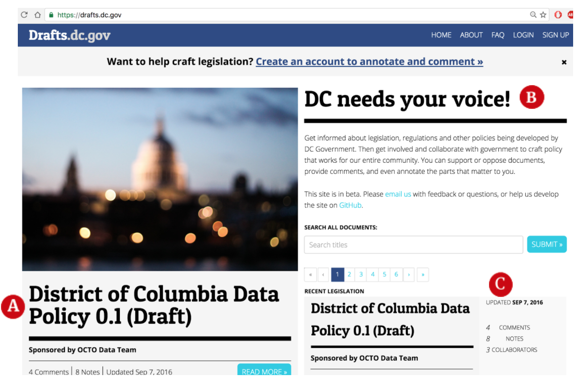
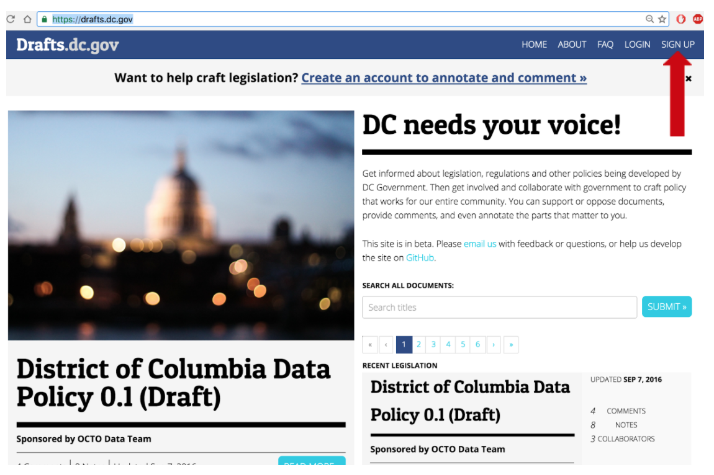
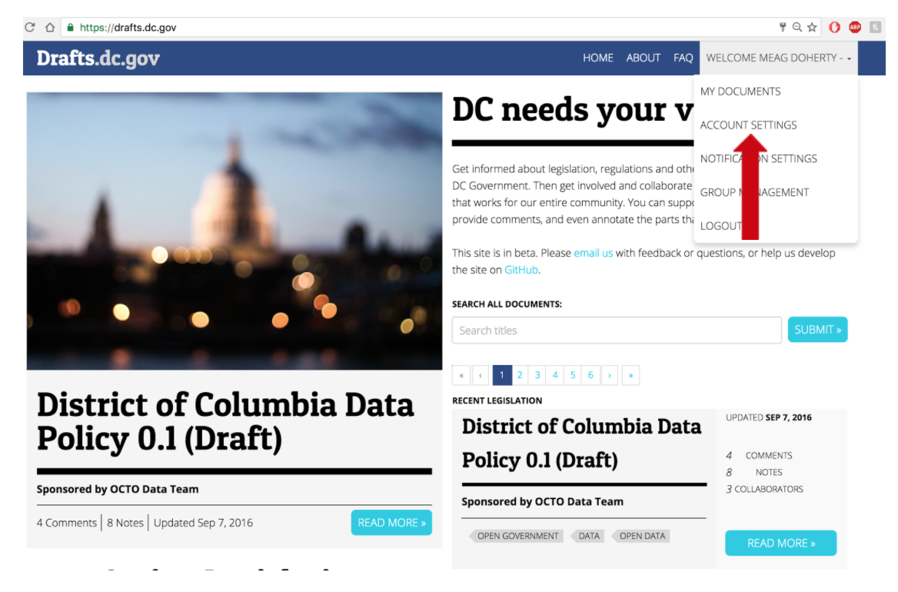
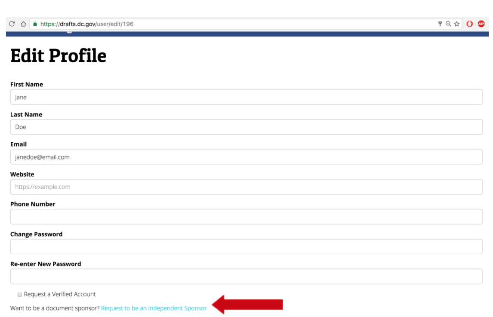
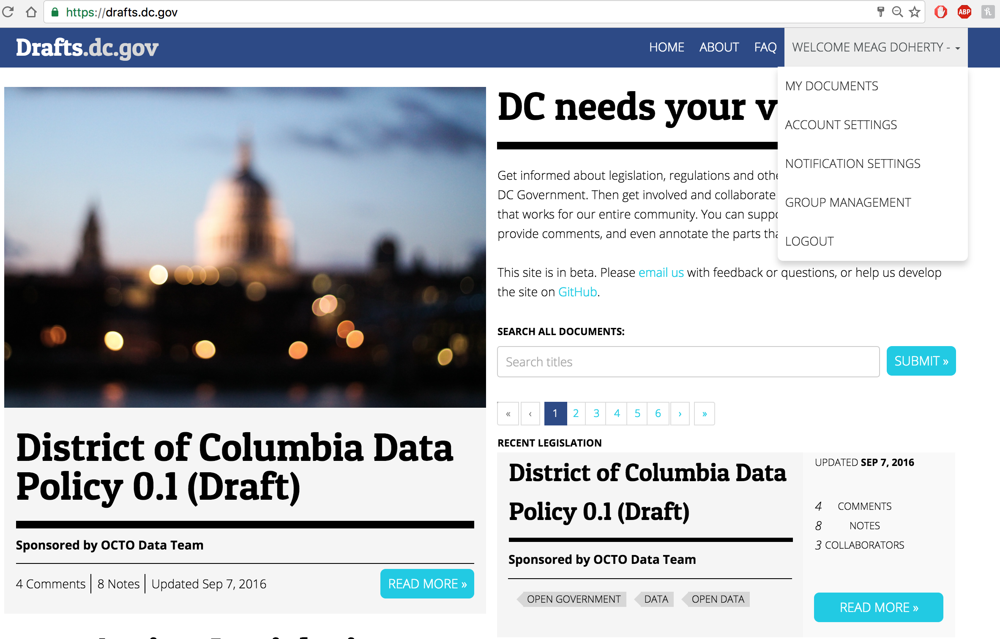
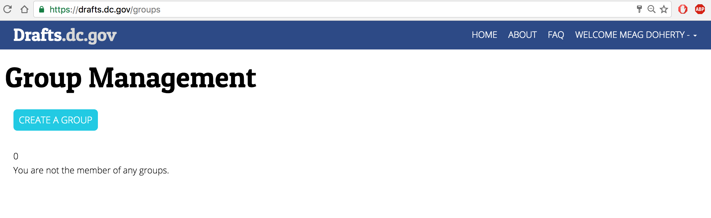
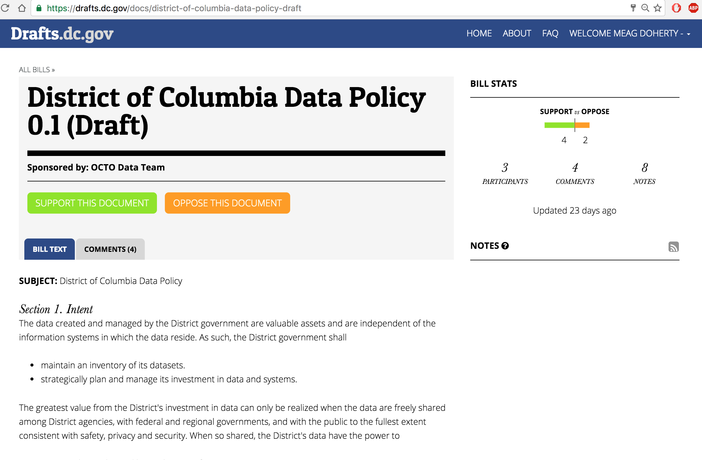
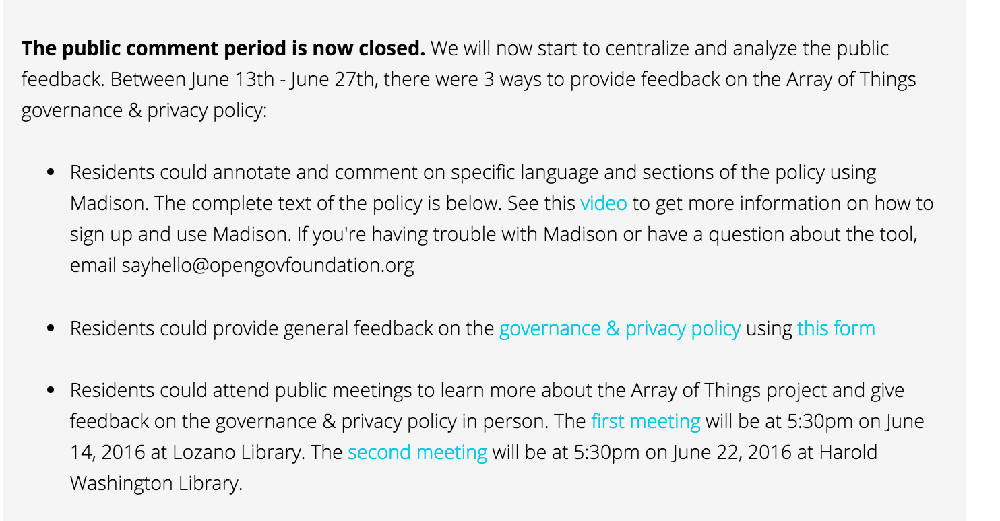

# [Welcome to the Madison community!](https://www.youtube.com/watch?v=qfhBO6u-xJY)

## Documents.MyMadison.io

### THE BASICS

#### A. Govern Better, Together
With Madison, you, your elected officials, and issue area experts are ablt to collaborate in order to help create and amend legislation from your elected officials.

#### B. Be Heard
Madison allows you to post your thoughts and questions directly onto currnet and pending legislation in the form of comments.

#### C. Create Better Policy
By governing together your government officials will have better knowledge and be better equipped to represent you.

### GETTING STARTED

#### Creating a **User Account**
1. Go to Documents.MyMadison.io and *click on 'Sign Up' in the top right corner of your screen.
2. Enter your *firt and last name, email address* (enter and address you want to be associated with Madison) and *create a password*
3. *Check your email!* Before proceeding into Madison, the administrator will send you a verification email to confirm you're not a robot and/or not attempting to make multiple accounts.
4. A Madison Administrator will accept your request within about 24 hours, and you can begin posting!
  - A message will appear in the 'Account Settings' section of you Account letting you know that your request has been accepted.

#### Becoming a Document Sponsor
1. Click on the drop-down menu (appears when you click on your name)
2. Scroll down to "Account Settings"
3. At the bottom of the page click the box requesting to be an Individual Sponsor and complete the form provided.
4. A Madison Administrator will accept your request, and you can begin posting!

#### Creating a **Sponsor**
1. Click on the *drop down menu* (appears when you click your name)
2. Select *"Sponsor Management"*
3. Select *"Create a Sponsor"* to submit a request to a Madison Administrator
4. Once the *request is accepted*, your sponsor has been created and you may:
  - *Add* other users to your sponsor
  - *Manage* other users' editing preferences
  - Create documents under the new sponsor

#### Posting a **Bill**
1. Click on the *drop-down menu* (appears when you click your name)
2. Create a *new document*
3. *Copy* the plain text of the document and *paste* it into the left-hand window
  - Format the bill by using the icons at the top of the page
4. To create a *table of contents* use the heading icon
  - Anything styled as Heading 1 will become a linked section of the table of contents
5. For more information on how to style documents in markdown, please refer to the [Markdown Cheatsheet](https://github.com/adam-p/markdown-here/wiki/Markdown-Cheatsheet)
**Tip** If you need to make *major edits* to your bill after users begin commenting, we recommend posting a second version of the document including those changes.
  - Major edits can throw off the location of comments in the text

#### Recommended Additional **Document Information**
1. *Status* of the bill
  a. Published: public and listed in the front page of documents
  b. Unpublished: only viewable by the creator and sponsor members
  c. Private: not displayed on homepage but viewable through link-sharing
2. Time and location of *all public hearings* pertaining to the bill
3. Insert links to *additional information* about the bill
  - Such as *press releases, news articles, or videos* about the bill, further information on your legislature's website
4. A *summary* or *introduction* for lengthy documents
5. *Tags* by topic

### TIPS AND RECOMMENDATIONS
#### *Timing*
1. It's best to release documents  in Madison *2-4 weeks before* a major action point, such as a public hearing about the bill
2.  Choose a *specific timeframe* when you will accept comments on Madison
  - Clearly communicate this timeframe during instances of outreach

#### *Outreach:* Crucial to Success on Madison
1. Use existing *community groups, community activists, and policy experts* to start the conversation and spread the word about Madison in your community
  - Research and use *existing hashtags* from your community to spread the word on social media
  - Tweet out thoughtful *comments or suggestions* (you may link directly to comments in your Tweet.)
  - *Add comments* from the elected official directly on the bill to show his or her presence and start a discussion
2. Work with committee staffers responsible for soliciting public testimony for hearings
3. Include information about using Madison when announcing a bill *traditionally*, such as through a newspaper or in a press release
4. Include in the outreach materials a short video of the elected officials *inviting* community members to use Madison

Specific *Examples* of Outreach
1. Small, in-person *information session* in public venues (with access to internet)
2. Video endorsements from the elected official
3. A "live online Public hearing" where community members can watch the public hearing/send questions in via Madison for the elected official to answer during the hearing
4. *Google Hangouts* between elected officials and community members centered around the bill on Madison

### MANAGING MADISON
#### Staying *Engaged* with Users
1. We recommend *assigning a staffer to check Madison a few times a week to monitor traffic and respond to questions.

#### Submitting Comments to the Public Record
1. At the end of the commenting period, *export comments*
2. *Send them* to your staffer(s) who is/(are) responsible for *collecting testimony*
3. Your staffer should be able to incorporate that informaiton into public record as they would emails
